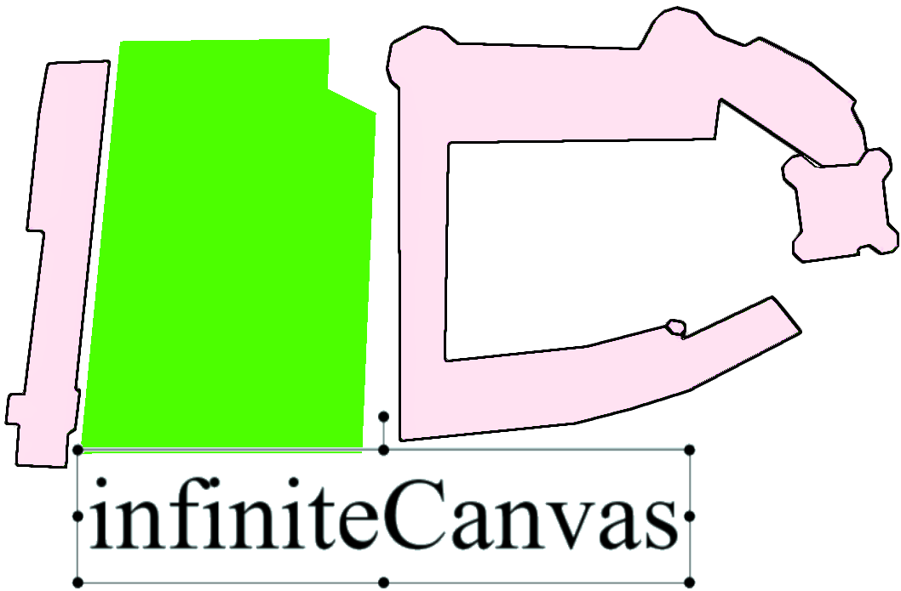

infinishute: initial repo for infinite canvas stuff

## About
This is an infinite whiteboard with interactive elements.   
Originally designed for students to manipulate math objects.    
Open for any kind of improvement, or degeneration.  

## Key features
Infinite canvas: space is not constrained in width, height, or depth    
Z-scroll: resize your elements in a blink   
Z-index: bring this in front of that    
Interactive objects     
Math objects    

## Video
https://tube.nocturlab.fr/videos/watch/eb01a9d6-8786-48e3-8035-4add6ec17cce

## Vision
A ton of ideas still remain in     
Some are written in english and some in french.     
Ideas rating: from *** (very good idea) to * (nice idea)
