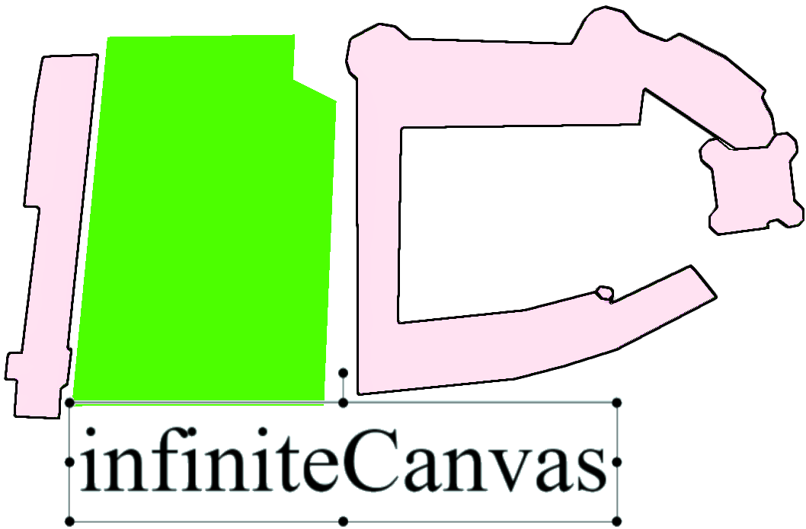

## Try it !
(Keep ² key pressed (right above TAB) and click to draw)

http://mathgame.fr/ic.html

## About
Infinite whiteboard with interactive elements.   
Originally designed for students to manipulate math objects.  
Can be used for presentations or games or both at the same time.  
Open for any kind of improvement, or degeneration.  

## Key features
Infinite canvas: space is not constrained in width, height, or depth    
Z-scroll: resize your elements in a blink   
Z-index: bring this in front of that    
Create and save presentations with text, images, videos, ...    
Interactive objects     
Operators      
_Math objects_    
_Composites_          
_Conveyors_    
_Vessels_   
_Pathmade operators_    
...and many others, scattered here and there    

## Video
https://tube.nocturlab.fr/videos/watch/playlist/285cab9f-8601-439b-aa6d-15ad3a4f23a7?playlistPosition=1     

## Try it ! (2)
1. Download project : [Code] (green button) > [Download ZIP]  
2. Open ic.html  
(3. Mess around with objects and keyboard shortcuts)   
   
For math stuff: go to /challenges/maths and open *.html   
 

## Vision
The vision is to create a galaxy of interactive objects to teach/learn differently.    

A ton of ideas still remain in     
Some are written in English and some in French.     
Ideas rating: from *** (very good idea) to * (nice idea)  
  Interested by an idea? Go on and code it yourself!

 There is some (huge) refactoring to do (Reduce loc nb, create lib(s) with separate files, improve performance, ...)
 See this as the first version of something bigger
 
 
    
    

## Development routine
3 tabs in Atom:   
programmashute: day-to-day low-level technical issues and progresses  
ic.html:     code  
:    "ideas worth coding"  
